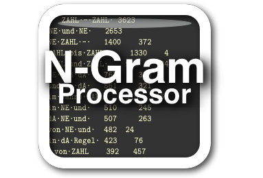

N-Gram Processor (NGP)
======================

*see the indluded manual.pdf for detailed information, including a tutorial*

DESCRIPTION
***********

The N-Gram Processor is a set of scripts and a Perl module allowing the creation and processing of n-gram lists out of text files. list.pl creates n-gram lists from text files, unify.pl combines several separate lists created by list.pl. Two shell script wrappers are also included: multi-list.sh which makes it convenient to create large numbers of lists and split-unify.sh which employs a splitting method to combine large numbers of lists more efficiently. The feature set of the N-Gram Processor is simple enough:

- creation of word n-gram lists out of input text, with n-gram frequencies
- listing of document counts (in how many docs an n-gram occurs)
- combination of large numbers of lists (of one n) into a single list
- unicode support
- support for processing of reasonably large corpora (depending on hardware)
- support for processing of annotated corpora

Please refer to the PDF-manual for a more detailed description. 

The NGP is based on code from two versions of the Ngram Statistics Package (NSP) by Ted Pedersen and collaborators (also known as Text::NSP). N-Gram Processor can be used for broadly the same purposes as the original NSP; the NGP differs from the NSP in the following areas:

- support for unicode-encoded in- and output and multi-language awareness
- generating document counts for n-grams
- modifications to allow the processing of larger amounts of data  

The NGP does not include a statistics module (a key component of the original NSP), although NSP's statistics module can be used on output of the N-Gram Processor under certain conditions. Since NGP is otherwise completely separate from the NSP, both the NGP and the NSP can be installed on the same machine without causing conflicts.

N-Gram Processor was tested under MacOS X and Xubuntu Linux, but should work well on any platform that can run Perl code and bash shell code.

INSTALLATION
************

To install, type the following commands in a terminal window while in the ngramprocessor directory:

	perl Makefile.PL
	make
	make test
	make install

The last command requires administrative privileges, so it might need to be
be run as `sudo make install`, for example on OS X. This installs the files
in the standard locations. For more details, see the PDF-manual.

The N-Gram Processor requires Perl version 5.8.5 or later and the shell scripts included require the bash shell.

AUTHOR
******
Andreas Buerki, <buerkiA@cardiff.ac.uk>  
Authors of the N-gram Statistics Package (NSP), of which N-Gram Processor is a branch: (v1.09) Ted Pedersen, Satanjeev Banerjee, Amruta Purandare, Bridget Thomson-McInnes, Saiyam Kohli; (the v1.10 re-write) Bjoern Wilmsmann.

SEE ALSO
********
http://buerki.github.io/ngramprocessor/
http://buerki.github.io/SubString/
http://www.d.umn.edu/~tpederse/nsp.html
https://github.com/BjoernKW/Publications/blob/master/Re-write_of_Text-NSP.pdf

COPYRIGHT
*********
Copyright 2013, Andreas Buerki

Copyright 2000-2006, Ted Pedersen, Satanjeev Banerjee,
Amruta Purandare, Bridget Thomson-McInnes and Saiyam Kohli  
Copyright 2006, Bjoern Wilmsmann

The NGP is free software: you can redistribute it and/or modify
it under the terms of the GNU General Public License as published by
the Free Software Foundation, either version 3 of the License, or
(at your option) any later version.

This program is distributed in the hope that it will be useful,
but WITHOUT ANY WARRANTY; without even the implied warranty of
MERCHANTABILITY or FITNESS FOR A PARTICULAR PURPOSE.  See the
GNU General Public License for more details.

You should have received a copy of the GNU General Public License
along with this program.  If not, see <http://www.gnu.org/licenses/>.